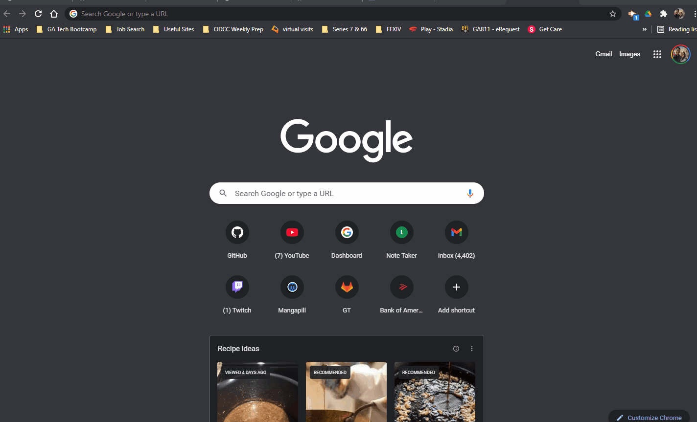

# Note Taker

User is brought to a landing page where user can open up note taker application. Upon entering notes html, user is able to type into text field and save notes generated. User has option to delete previous notes by clicking on the trash can icon. Utilizes basic routing employed with node and express.

## Demo

Insert gif or link to demo

## Lessons Learned

I'd been running behind on homeworks due to being overwhelmed by new concepts and loss of time transitioning into new role at my work. While collaborating with fellow cohorts in our last major project, everything started to click and this was good refresher to go back and work on these homeworks I had missed.
  
## Deployment

You can find a deployed live demo at:

https://eccentricality-note-taker.herokuapp.com/

  